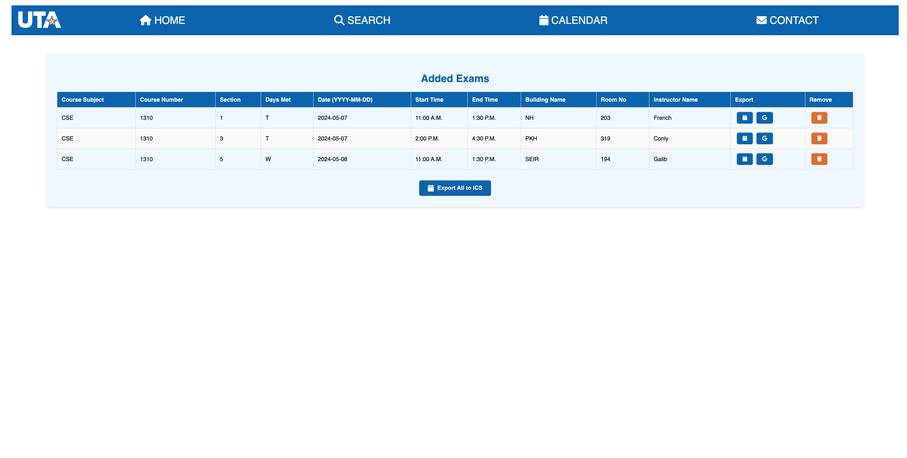

# Welcome to MavExamScheduler!

This is a comprehensive exam scheduling tool for the 40,000+ students at the University of Texas at Arlington. Simply choose your exams and add them to your calendar all in one convenient location.

This tool uses ReactJS for the frontend hosted on GitHub Pages, Spring Boot for the backend hosted on Heroku, and PostgreSQL for the database on Supabase.

## Give it a try!

Try this tool out [here](https://rm206.github.io/MavExamScheduler/)!

## Components

- **PostgreSQL Database**: Used to store the exam data including course, dates, section, days and other relevant information. The database is hosted on Supabase.
- **Spring Boot Backend**: Gives a Restful API to the frontend to get the exam data from the database. The backend is hosted on Heroku.
- **ReactJS Frontend**: A intuitive and user-friendly interface to search for exams and add them to the calendar. The frontend is hosted on GitHub Pages.

## Other Relevant Information

Backend code can be found [here](https://github.com/rm206/MavExamSchedulerBackend)

Scripts to get the data, organize and clean it can be found [here](https://github.com/rm206/uta_exam_data)

## Disclaimer

While I, the author and builder, have made every effort to ensure the accuracy and reliability of the information provided, I cannot guarantee its completeness or correctness. Users are strongly advised to double-check with their instructor or refer to the master plan to ensure they have the most current and accurate information. I am not responsible for any errors or omissions, or for any outcomes related to the use of this information.

This project is not officially associated with The University of Texas at Arlington (UTA) and has been created through personal effort. All UTA symbols, logos, and trademarks are the property of The University of Texas at Arlington and are used here for informational purposes only.